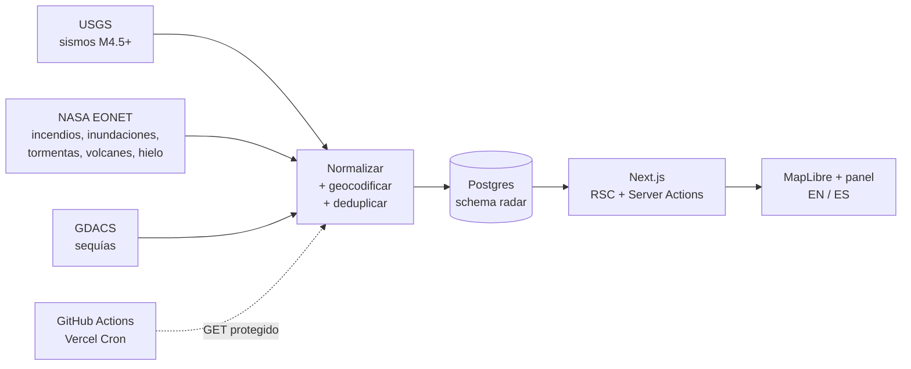

# Radar

Tablero público de **amenazas naturales en curso** — sismos, incendios, inundaciones,
tormentas, volcanes, hielo y sequías — sobre un globo interactivo.

**Demo en vivo: [radar.riverogz.com](https://radar.riverogz.com/)**

Tres fuentes oficiales heterogéneas entran por un mismo pipeline, se normalizan a un
modelo único y salen como un mapa y un flujo de eventos. Sin intervención manual y sin
costo de IA.



## Decisiones de diseño

Lo interesante del proyecto no es el mapa, son las restricciones bajo las que está construido.

**Geocodificación inversa sin API externa.** Cada evento llega con coordenadas pero sin
país. En vez de pegarle a un servicio de geocoding —que cuesta, tiene rate limit y añade
un punto de falla— el país se resuelve por _point-in-polygon_ (ray casting) contra un
GeoJSON de fronteras incluido en el repo, en memoria. Costo $0, sin cuota, sin red.

**Deduplicación por identidad de la fuente.** Cada registro lleva un `external_id`
prefijado (`usgs:`, `eonet:`, `gdacs:`) con índice único, y la inserción es
`ON CONFLICT DO NOTHING`. La ingesta es idempotente: puede correr dos veces, o desde dos
disparadores distintos a la vez, sin duplicar nada.

**La purga tiene freno de seguridad.** Se retienen 90 días de eventos, pero la limpieza
se salta a sí misma si no entraron datos en las últimas 24h. Si la ingesta se rompe,
el sistema prefiere mostrar historia vieja antes que vaciar la base.

**Degradación elegante por sección.** Mapa, estadísticas, listado y tira inferior son
cada uno su propio límite de Suspense con su propio manejo de error. Si una consulta
falla, esa sección se cae sola: la página nunca queda en blanco.

**Caché con deduplicación de peticiones en vuelo.** `memoTtl` (`lib/utils/cache.ts`)
cachea 60s y, más importante, si llegan N peticiones concurrentes con el caché frío,
todas comparten **una** consulta en lugar de abrir N conexiones.
Es una mitigación parcial y consciente: en serverless el caché vive por instancia, así
que el beneficio real llega cuando el proceso es de larga vida.

**El detalle de un evento no viaja en el payload del mapa.** Los ~2.000 puntos del globo
se envían sin la `url` de la fuente; se pide por Server Action solo al abrir un evento.
Menos HTML y menos superficie expuesta.

**Portable por diseño.** Postgres por connection string (sin SDK propietario) y
`output: standalone`. Mover esto de Vercel a un VPS es cambiar dónde corre, no qué corre.

**Costo de IA: $0.** No hay LLM en el camino. La utilidad viene de normalizar bien tres
fuentes que no hablan entre sí.

## Detalles que costaron

- **EONET mezcla convenciones de coordenadas**: los `Point` vienen `[lng, lat]` (estándar
  GeoJSON) pero los `Polygon` vienen `[lat, lng]`. Sin normalizar eso, los eventos de área
  aterrizan en el país equivocado.
- **No todas las fuentes de EONET son páginas web**: JTWC y NATICE devuelven `.csv`,
  `.txt`, `.ascat`. Se filtran para no ofrecer al usuario un enlace que descarga un archivo crudo.
- **El idioma se resuelve en el servidor** desde cookie, así el HTML ya sale traducido y no
  hay parpadeo ni desajuste de hidratación.

## Seguridad

- CSP propia con `frame-ancestors 'none'` y `object-src 'none'`; `unsafe-eval` solo en
  desarrollo (React lo exige) y nunca en producción.
- `X-Frame-Options`, `X-Content-Type-Options`, `Referrer-Policy`, `Permissions-Policy`;
  `poweredByHeader` desactivado.
- El endpoint de ingesta valida un secreto solo por cabecera y con comparación en
  **tiempo constante** (`timingSafeEqual`).
- Entradas de las Server Actions saneadas contra lista blanca; las URLs de terceros pasan
  por un validador que solo deja sobrevivir `https:`.
- Los errores nunca se propagan al cliente: se registran en servidor y la UI muestra un
  mensaje genérico.
- La analítica es de primera parte (`/_vercel/insights`), sin cookies y sin scripts de
  terceros, para no abrir la CSP ni necesitar banner de consentimiento.
- El proyecto pasó una auditoría pre-pentest contra el catálogo OWASP Top 10 2025 /
  API Top 10 2023; los hallazgos de código están subsanados.

## Stack

Next.js 16 (App Router, RSC, Server Actions) · TypeScript `strict` · Tailwind v4 ·
Drizzle ORM · Postgres (Supabase, transaction pooler) · MapLibre GL con proyección de
globo y teselas de NASA GIBS · Vercel tras Cloudflare.

## Estructura

```
app/           rutas, layout, Server Actions y endpoints (cron, health)
lib/
  components/  UI (cliente y servidor)
  services/    fuentes externas, acceso a datos, retención
  db/          cliente Drizzle y esquema
  utils/       caché, fechas, geocodificación inversa, saneamiento
  assets/      i18n, catálogo de tipos de amenaza, países
drizzle/       migraciones SQL
```

Las páginas no consultan la base de datos: llaman servicios.

## Desarrollo

```bash
npm install
cp .env.example .env.local     # DATABASE_URL, DIRECT_URL, CRON_SECRET
npm run dev
```

Las migraciones están en `drizzle/` y se aplican contra el _session pooler_; la aplicación
usa el _transaction pooler_.

## Ingesta

Un `GET` protegido a `/api/cron/ingest` dispara el ciclo completo (traer → normalizar →
insertar → purgar). Lo invocan hoy GitHub Actions y un cron diario de Vercel, pero el
disparador es intercambiable: en un servidor propio es una línea de `crontab` contra el
mismo endpoint.

> Nota honesta: los workflows programados de GitHub Actions sufren retrasos importantes.
> Pidiendo cada 30 minutos, la cadencia real medida ronda las 2 horas. Mover el disparador
> a un scheduler puntual está en el roadmap.

## Roadmap

- [x] Ingesta de tres fuentes, normalización y deduplicación
- [x] Globo interactivo, filtros por tipo/país/rango y scroll infinito
- [x] Bilingüe EN/ES resuelto en servidor
- [x] Cabeceras de seguridad, CSP y auditoría pre-pentest
- [x] Analítica de tráfico sin cookies ni scripts de terceros
- [ ] Open Graph para vista previa al compartir
- [ ] Disparador de ingesta puntual (cada 15 min)
- [ ] Migración a servidor propio

---

Hecho por [Jhon Rivero](https://jhon.riverogz.com/).
