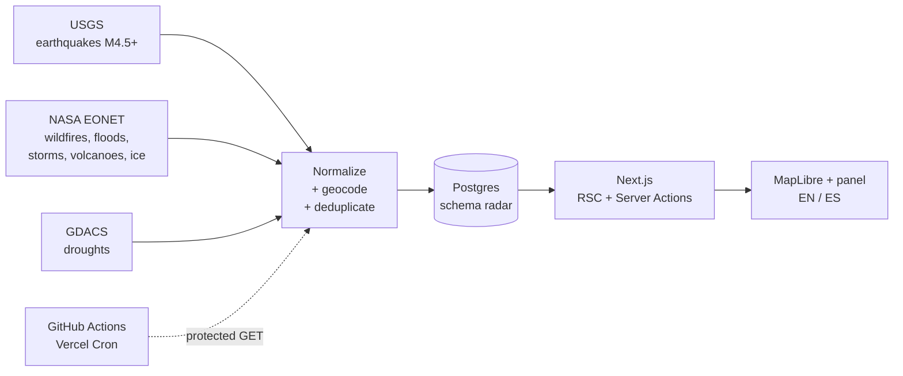
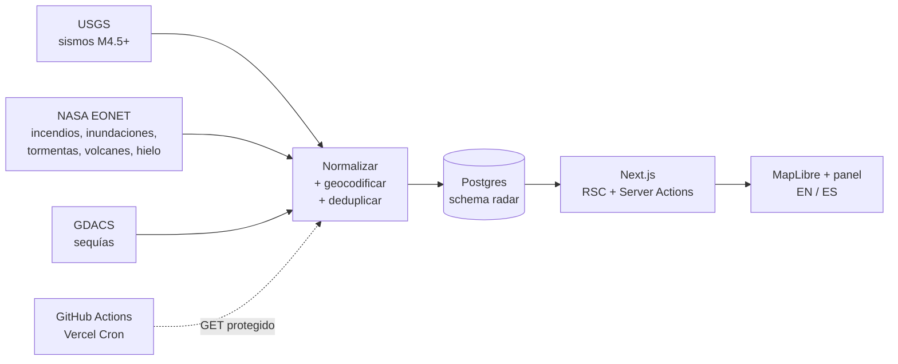

# Radar

[English](#english) · [Español](#español)

---

## English

Public dashboard of **ongoing natural hazards** — earthquakes, wildfires, floods,
storms, volcanoes, ice and droughts — on an interactive globe.

**Live demo: [radar.riverogz.com](https://radar.riverogz.com/)**

Three heterogeneous official sources go through a single pipeline, are normalized into
one model and come out as a map and an event feed. No manual work and no AI cost.


```mermaid
flowchart LR
  USGS[USGS<br/>earthquakes M4.5+] --> ING
  EONET[NASA EONET<br/>wildfires, floods,<br/>storms, volcanoes, ice] --> ING
  GDACS[GDACS<br/>droughts] --> ING

  ING[Normalize<br/>+ geocode<br/>+ deduplicate] --> PG[(Postgres<br/>schema radar)]
  PG --> APP[Next.js<br/>RSC + Server Actions]
  APP --> UI[MapLibre + panel<br/>EN / ES]

  CRON[GitHub Actions<br/>Vercel Cron] -.->|protected GET| ING
```

### Design decisions

The interesting part of the project is not the map, it is the constraints it was built under.

**Reverse geocoding without an external API.** Every event arrives with coordinates but
no country. Instead of calling a geocoding service —which costs money, has rate limits
and adds a point of failure— the country is resolved by _point-in-polygon_ (ray casting)
against a borders GeoJSON bundled in the repo, in memory. $0 cost, no quota, no network.

**Deduplication by source identity.** Every record carries a prefixed `external_id`
(`usgs:`, `eonet:`, `gdacs:`) with a unique index, and inserts use
`ON CONFLICT DO NOTHING`. Ingestion is idempotent: it can run twice, or from two
different triggers at once, without duplicating anything.

**The purge has a safety brake.** Events are kept for 90 days, but the cleanup skips
itself if no data came in during the last 24h. If ingestion breaks, the system would
rather show old history than empty the database.

**Graceful degradation per section.** Map, stats, list and bottom strip are each their
own Suspense boundary with their own error handling. If a query fails, only that
section goes down: the page is never blank.

**Cache with in-flight request deduplication.** `memoTtl` (`lib/utils/cache.ts`)
caches for 60s and, more importantly, when N concurrent requests hit a cold cache they
all share **one** query instead of opening N connections.
It is a partial, deliberate mitigation: on serverless the cache lives per instance, so
the real benefit comes when the process is long-lived.

**Event details do not travel in the map payload.** The ~2,000 points on the globe are
sent without the source `url`; it is requested through a Server Action only when an
event is opened. Less HTML and less exposed surface.

**Portable by design.** Postgres through a connection string (no proprietary SDK) and
`output: standalone`. Moving this from Vercel to a VPS changes where it runs, not what runs.

**AI cost: $0.** There is no LLM in the path. The value comes from properly normalizing
three sources that do not talk to each other.

### Details that took work

- **EONET mixes coordinate conventions**: `Point`s come as `[lng, lat]` (GeoJSON
  standard) but `Polygon`s come as `[lat, lng]`. Without normalizing that, area events
  land in the wrong country.
- **Not every EONET source is a web page**: JTWC and NATICE return `.csv`, `.txt`,
  `.ascat`. They are filtered out so users are never offered a link that downloads a raw file.
- **Language is resolved on the server** from a cookie, so the HTML is already
  translated and there is no flicker or hydration mismatch.

### Security

- Custom CSP with `frame-ancestors 'none'` and `object-src 'none'`; `unsafe-eval` only
  in development (React requires it) and never in production.
- `X-Frame-Options`, `X-Content-Type-Options`, `Referrer-Policy`, `Permissions-Policy`;
  `poweredByHeader` disabled.
- The ingestion endpoint checks a secret from a header only, with a **constant-time**
  comparison (`timingSafeEqual`).
- Server Action inputs are sanitized against an allowlist; third-party URLs go through
  a validator that only lets `https:` through.
- Errors never reach the client: they are logged on the server and the UI shows a
  generic message.
- Analytics are first-party (`/_vercel/insights`), with no cookies and no third-party
  scripts, so the CSP stays closed and no consent banner is needed.
- The project went through a pre-pentest audit against the OWASP Top 10 2025 /
  API Top 10 2023 catalog; the code findings are fixed.

### Stack

Next.js 16 (App Router, RSC, Server Actions) · TypeScript `strict` · Tailwind v4 ·
Drizzle ORM · Postgres (Supabase, transaction pooler) · MapLibre GL with globe
projection and NASA GIBS tiles · Vercel behind Cloudflare.

### Structure

```
app/           routes, layout, Server Actions and endpoints (cron, health)
lib/
  components/  UI (client and server)
  services/    external sources, data access, retention
  db/          Drizzle client and schema
  utils/       cache, dates, reverse geocoding, sanitization
  assets/      i18n, hazard type catalog, countries
drizzle/       SQL migrations
```

Pages do not query the database: they call services.

### Development

```bash
npm install
cp .env.example .env.local     # DATABASE_URL, DIRECT_URL, CRON_SECRET
npm run dev
```

Migrations live in `drizzle/` and are applied against the _session pooler_; the app
uses the _transaction pooler_.

### Ingestion

A protected `GET` to `/api/cron/ingest` runs the full cycle (fetch → normalize →
insert → purge). Today it is called by GitHub Actions and a daily Vercel cron, but the
trigger is interchangeable: on a self-hosted server it is one `crontab` line against the
same endpoint.

> Honest note: scheduled GitHub Actions workflows suffer significant delays. Asking for
> every 30 minutes, the measured real cadence is around 2 hours. Moving the trigger to a
> punctual scheduler is on the roadmap.

### Roadmap

- [x] Ingestion from three sources, normalization and deduplication
- [x] Interactive globe, filters by type/country/range and infinite scroll
- [x] Bilingual EN/ES resolved on the server
- [x] Security headers, CSP and pre-pentest audit
- [x] Traffic analytics without cookies or third-party scripts
- [ ] Open Graph for share previews
- [ ] Punctual ingestion trigger (every 15 min)
- [ ] Migration to a self-hosted server

### Author

Built by [Jhon Rivero](https://jhon.riverogz.com/).

---

## Español

Tablero público de **amenazas naturales en curso** — sismos, incendios, inundaciones,
tormentas, volcanes, hielo y sequías — sobre un globo interactivo.

**Demo en vivo: [radar.riverogz.com](https://radar.riverogz.com/)**

Tres fuentes oficiales heterogéneas entran por un mismo pipeline, se normalizan a un
modelo único y salen como un mapa y un flujo de eventos. Sin intervención manual y sin
costo de IA.


```mermaid
flowchart LR
  USGS[USGS<br/>sismos M4.5+] --> ING
  EONET[NASA EONET<br/>incendios, inundaciones,<br/>tormentas, volcanes, hielo] --> ING
  GDACS[GDACS<br/>sequías] --> ING

  ING[Normalizar<br/>+ geocodificar<br/>+ deduplicar] --> PG[(Postgres<br/>schema radar)]
  PG --> APP[Next.js<br/>RSC + Server Actions]
  APP --> UI[MapLibre + panel<br/>EN / ES]

  CRON[GitHub Actions<br/>Vercel Cron] -.->|GET protegido| ING
```

### Decisiones de diseño

Lo interesante del proyecto no es el mapa, son las restricciones bajo las que está construido.

**Geocodificación inversa sin API externa.** Cada evento llega con coordenadas pero sin
país. En vez de pegarle a un servicio de geocoding —que cuesta, tiene rate limit y añade
un punto de falla— el país se resuelve por _point-in-polygon_ (ray casting) contra un
GeoJSON de fronteras incluido en el repo, en memoria. Costo $0, sin cuota, sin red.

**Deduplicación por identidad de la fuente.** Cada registro lleva un `external_id`
prefijado (`usgs:`, `eonet:`, `gdacs:`) con índice único, y la inserción es
`ON CONFLICT DO NOTHING`. La ingesta es idempotente: puede correr dos veces, o desde dos
disparadores distintos a la vez, sin duplicar nada.

**La purga tiene freno de seguridad.** Se retienen 90 días de eventos, pero la limpieza
se salta a sí misma si no entraron datos en las últimas 24h. Si la ingesta se rompe,
el sistema prefiere mostrar historia vieja antes que vaciar la base.

**Degradación elegante por sección.** Mapa, estadísticas, listado y tira inferior son
cada uno su propio límite de Suspense con su propio manejo de error. Si una consulta
falla, esa sección se cae sola: la página nunca queda en blanco.

**Caché con deduplicación de peticiones en vuelo.** `memoTtl` (`lib/utils/cache.ts`)
cachea 60s y, más importante, si llegan N peticiones concurrentes con el caché frío,
todas comparten **una** consulta en lugar de abrir N conexiones.
Es una mitigación parcial y consciente: en serverless el caché vive por instancia, así
que el beneficio real llega cuando el proceso es de larga vida.

**El detalle de un evento no viaja en el payload del mapa.** Los ~2.000 puntos del globo
se envían sin la `url` de la fuente; se pide por Server Action solo al abrir un evento.
Menos HTML y menos superficie expuesta.

**Portable por diseño.** Postgres por connection string (sin SDK propietario) y
`output: standalone`. Mover esto de Vercel a un VPS es cambiar dónde corre, no qué corre.

**Costo de IA: $0.** No hay LLM en el camino. La utilidad viene de normalizar bien tres
fuentes que no hablan entre sí.

### Detalles que costaron

- **EONET mezcla convenciones de coordenadas**: los `Point` vienen `[lng, lat]` (estándar
  GeoJSON) pero los `Polygon` vienen `[lat, lng]`. Sin normalizar eso, los eventos de área
  aterrizan en el país equivocado.
- **No todas las fuentes de EONET son páginas web**: JTWC y NATICE devuelven `.csv`,
  `.txt`, `.ascat`. Se filtran para no ofrecer al usuario un enlace que descarga un archivo crudo.
- **El idioma se resuelve en el servidor** desde cookie, así el HTML ya sale traducido y no
  hay parpadeo ni desajuste de hidratación.

### Seguridad

- CSP propia con `frame-ancestors 'none'` y `object-src 'none'`; `unsafe-eval` solo en
  desarrollo (React lo exige) y nunca en producción.
- `X-Frame-Options`, `X-Content-Type-Options`, `Referrer-Policy`, `Permissions-Policy`;
  `poweredByHeader` desactivado.
- El endpoint de ingesta valida un secreto solo por cabecera y con comparación en
  **tiempo constante** (`timingSafeEqual`).
- Entradas de las Server Actions saneadas contra lista blanca; las URLs de terceros pasan
  por un validador que solo deja sobrevivir `https:`.
- Los errores nunca se propagan al cliente: se registran en servidor y la UI muestra un
  mensaje genérico.
- La analítica es de primera parte (`/_vercel/insights`), sin cookies y sin scripts de
  terceros, para no abrir la CSP ni necesitar banner de consentimiento.
- El proyecto pasó una auditoría pre-pentest contra el catálogo OWASP Top 10 2025 /
  API Top 10 2023; los hallazgos de código están subsanados.

### Stack

Next.js 16 (App Router, RSC, Server Actions) · TypeScript `strict` · Tailwind v4 ·
Drizzle ORM · Postgres (Supabase, transaction pooler) · MapLibre GL con proyección de
globo y teselas de NASA GIBS · Vercel tras Cloudflare.

### Estructura

```
app/           rutas, layout, Server Actions y endpoints (cron, health)
lib/
  components/  UI (cliente y servidor)
  services/    fuentes externas, acceso a datos, retención
  db/          cliente Drizzle y esquema
  utils/       caché, fechas, geocodificación inversa, saneamiento
  assets/      i18n, catálogo de tipos de amenaza, países
drizzle/       migraciones SQL
```

Las páginas no consultan la base de datos: llaman servicios.

### Desarrollo

```bash
npm install
cp .env.example .env.local     # DATABASE_URL, DIRECT_URL, CRON_SECRET
npm run dev
```

Las migraciones están en `drizzle/` y se aplican contra el _session pooler_; la aplicación
usa el _transaction pooler_.

### Ingesta

Un `GET` protegido a `/api/cron/ingest` dispara el ciclo completo (traer → normalizar →
insertar → purgar). Lo invocan hoy GitHub Actions y un cron diario de Vercel, pero el
disparador es intercambiable: en un servidor propio es una línea de `crontab` contra el
mismo endpoint.

> Nota honesta: los workflows programados de GitHub Actions sufren retrasos importantes.
> Pidiendo cada 30 minutos, la cadencia real medida ronda las 2 horas. Mover el disparador
> a un scheduler puntual está en el roadmap.

### Roadmap

- [x] Ingesta de tres fuentes, normalización y deduplicación
- [x] Globo interactivo, filtros por tipo/país/rango y scroll infinito
- [x] Bilingüe EN/ES resuelto en servidor
- [x] Cabeceras de seguridad, CSP y auditoría pre-pentest
- [x] Analítica de tráfico sin cookies ni scripts de terceros
- [ ] Open Graph para vista previa al compartir
- [ ] Disparador de ingesta puntual (cada 15 min)
- [ ] Migración a servidor propio

### Autor

Hecho por [Jhon Rivero](https://jhon.riverogz.com/).
